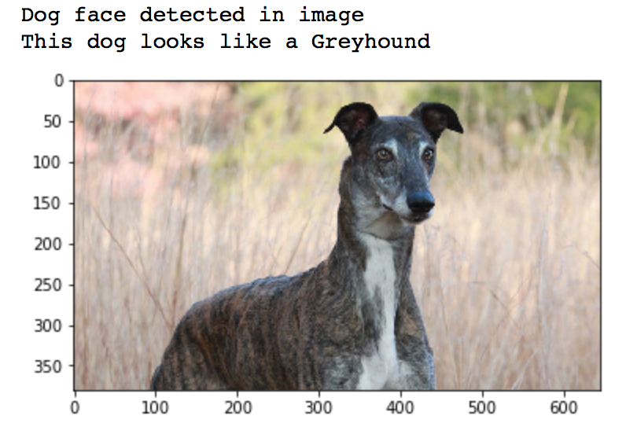

[//]: # (Image References)

[image1]: ./sample_output.png "Sample Output"


# Convolutional Neural Networks for Dog Breed Identification

### Juan E. Rolon, 2018.



## Project overview

In this project, I implemented a real-world application of _Convolutional Neural Networks (CNNs)_ to develop an image classifier. This project was submitted as part of the requisites required to obtain **Machine Learning** Engineer Nanodegree from Udacity. It also forms part of the **Artificial Intelligence** curriculum.

The project requires building a pipeline that can be used within a web or mobile application to process real-world, user-supplied images.  Given an image of a dog, the algorithm indetifies the type of breed associated to the image. The classifier is also capable of identifying a resembling dog breed when supplied with images of humans or closely related animals. 

Along with exploring state-of-the-art convolutional neural networks classification models, this project deals with important design decisions of image classifiers, and challenges involved in piecing together a series of models designed to perform various tasks in a data processing pipeline.

## Installation

#### Required Libraries 
- Sklearn 
- Tensorflow with GPU support
- OpenCV
- Keras  
- Imbalanced-learn
- Feather format   

#### Git Cloning and Datasets Downloading   


1. Clone the following repository to obtain the required datasets.
	
	```	
		git clone https://github.com/juanerolon/convolutional-neural-networks.git
	```
2. Download the [dog dataset](https://s3-us-west-1.amazonaws.com/udacity-aind/dog-project/dogImages.zip).  Unzip the folder and place it in the repo, at location `path/to/dog-project/dogImages`. 
3. Download the [human dataset](https://s3-us-west-1.amazonaws.com/udacity-aind/dog-project/lfw.zip).  Unzip the folder and place it in the repo, at location `path/to/dog-project/lfw`.  If you are using a Windows machine, you are encouraged to use [7zip](http://www.7-zip.org/) to extract the folder. 
4. Donwload the [VGG-16 bottleneck features](https://s3-us-west-1.amazonaws.com/udacity-aind/dog-project/DogVGG16Data.npz) for the dog dataset.  Place it in the repo, at location `path/to/dog-project/bottleneck_features`.
5. Obtain the necessary Python packages, and switch Keras backend to Tensorflow.  
	
	For __Mac/OSX__:
	```
		conda env create -f requirements/aind-dog-mac.yml
		source activate aind-dog
		KERAS_BACKEND=tensorflow python -c "from keras import backend"
	```

	For __Linux__:
	```
		conda env create -f requirements/aind-dog-linux.yml
		source activate aind-dog
		KERAS_BACKEND=tensorflow python -c "from keras import backend"
	```

	For __Windows__:
	```
		conda env create -f requirements/aind-dog-windows.yml
		activate aind-dog
		set KERAS_BACKEND=tensorflow
		python -c "from keras import backend"
	```
6. Open the notebook in the present repositry and follow along.
	
	```
		jupyter notebook dog_app.ipynb
	```
    
#### Infrastructure required

Your model can be trained on a local CPU-GPU, or if needed on an Amazon Web Services EC2 GPU instance.  Please refer to the following instructions for setting up a GPU instance for this project.  ([link for AIND students](https://classroom.udacity.com/nanodegrees/nd889/parts/16cf5df5-73f0-4afa-93a9-de5974257236/modules/53b2a19e-4e29-4ae7-aaf2-33d195dbdeba/lessons/2df3b94c-4f09-476a-8397-e8841b147f84/project), [link for MLND students](https://classroom.udacity.com/nanodegrees/nd009/parts/99115afc-e849-48cf-a580-cb22eea2ba1b/modules/777db663-2b0d-4040-9ae4-bf8c6ab8f157/lessons/a088c519-05af-4589-a1e2-2c484b1268ef/project))

## Usage

You need an IDE capable of editing and running Ipython notebooks. If Jupyter is installed in your distribution:   

`$ jupyter notebook cnn-image-classifier.ipynb`

## Project Workflow

#### Step 1: Detect Humans

| Criteria       		|    Procedure	        			            | 
|:---------------------:|:---------------------------------------------------------:| 
| __1:__ Assess the Human Face Detector |  Obtain the percentage of the first 100 images in the dog and human face datasets with a detected human face.          |
| __2:__ Assess the Human Face Detector |  Assess whether Haar cascades for face detection are an appropriate technique for human detection.    |

#### Step 2: Detect Dogs

| Criteria       		|     Proceduer	        			            | 
|:---------------------:|:---------------------------------------------------------:| 
| __3:__ Assess the Dog Detector |  Obtain the percentage of the first 100 images in the dog and human face datasets with a detected dog.          |

#### Step 3: Create a CNN to Classify Dog Breeds (from Scratch)

| Criteria       		|     Procedure	        			            | 
|:---------------------:|:---------------------------------------------------------:| 
| Model Architecture | Select a CNN architecture. |
| Train the Model | Obtain the number of epochs used to train the algorithm. |
| Test the Model | Optimize model to obtain at least 1% accuracy on the test set. |


#### Step 5: Create a CNN to Classify Dog Breeds (using Transfer Learning)

| Criteria       		|     Procedure	        			            | 
|:---------------------:|:---------------------------------------------------------:| 
| Obtain Bottleneck Features | Download the bottleneck features corresponding to one of the Keras pre-trained models (VGG-19, ResNet-50, Inception, or Xception). |
| Model Architecture | Select a model architecture.  |
|Model Architecture | Assess whether the chosen architecture succeeds in the classification task.  |
| Compile the Model | Compile the cnn architecture by specifying the loss function and optimizer. |
| Train the Model    | Implement a checkpointing procedure to train the model to select the model with the best validation loss. |
| Load the Model with the Best Validation Loss    | Load the model weights that attained the least validation loss. |
| Test the Model    | Obtain an accuracy on the test set at least of 60% or greater. |
| Predict Dog Breed with the Model | Implement a function that takes a file path to an image as input and returns the dog breed that is predicted by the CNN. |


#### Step 6: Test Algorithm

| Criteria       		|     Procedure	        			            | 
|:---------------------:|:---------------------------------------------------------:| 
| Test Algorithm   | Use the CNN from Step 5 to detect dog breed.  Assess whether output for each detected image type (dog, human, other) is different from previous cases. Obtain either predicted actual (or resembling) dog breed. |

#### Step 7: Test your Algorithm
| Criteria       		|     Procedure	        			            | 
|:---------------------:|:---------------------------------------------------------:| 
| Test Algorithm on Sample Images   | Test at least 6 images, including at least two human and two dog images. |
| Test Algorithm on Sample Images | Assess performance of the algorithm and at least three possible points of improvement. |

## Further Tests and Improvements


#### (1) Augment the Training Data 

[Augmenting the training and/or validation set](https://blog.keras.io/building-powerful-image-classification-models-using-very-little-data.html) might help improve model performance. 

#### (2) Turn your Algorithm into a Web App

Turn code into a web app using [Flask](http://flask.pocoo.org/) or [web.py](http://webpy.org/docs/0.3/tutorial)!  

#### (3) Overlay Dog Ears on Detected Human Heads

Overlay a Snapchat-like filter with dog ears on detected human heads.  Determine where to place the ears through the use of the OpenCV face detector, which returns a bounding box for the face.  It is also possible to overlay a dog nose filter, some nice tutorials for facial keypoints detection exist [here](https://www.kaggle.com/c/facial-keypoints-detection/details/deep-learning-tutorial).

#### (4) Add Functionality for Dog Mutts

Currently, if a dog appears 51% German Shepherd and 49% poodle, only the German Shephard breed is returned.  The algorithm may fail for every mixed breed dog.  Of course, if a dog is predicted as 99.5% Labrador, it is still worthwhile to round this to 100% and return a single breed; so, you will have to find a nice balance.  

#### (5) Experiment with Multiple Dog/Human Detectors

Perform a systematic evaluation of various methods for detecting humans and dogs in images.  Provide improved methodology for the `face_detector` and `dog_detector` functions.


## License


The present project constitutes intellectual work towards completion of Udacitys Machine Learning Engineer Nanodegree. You are free to modify and adapt the code to your needs, but please avoid using an exact copy of this work as your own to obtain credits towards any educational platform, doing so may imply plagiarism on your part. 


```python

```
